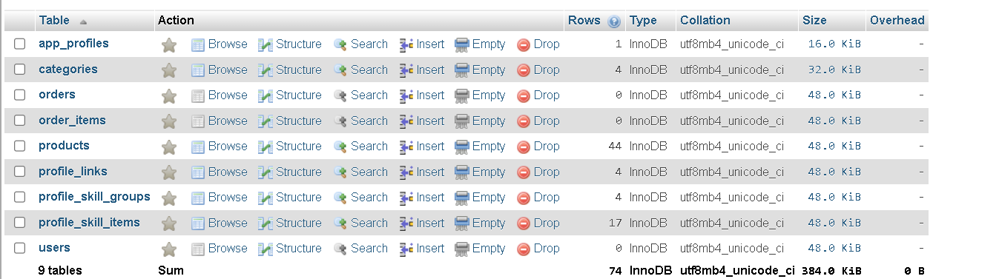
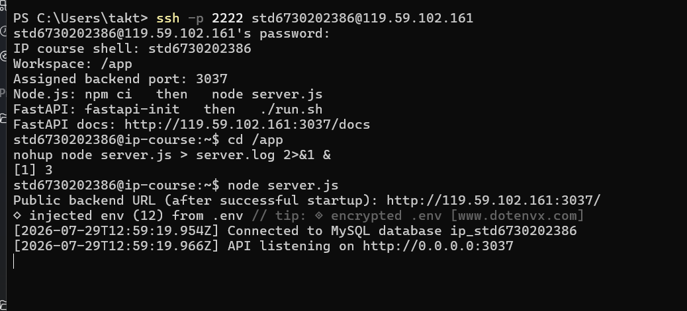
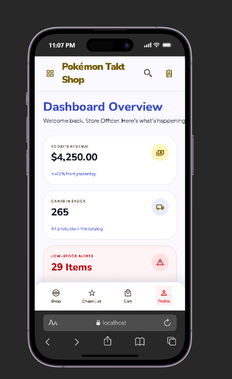

# React Native + Cloud DB

รหัสนักศึกษา 6730202386

สร้าง database ใน mysql ใช้ในการเก็บข้อมูลสินค้า

database ชื่อ ip_std6730202386

มีตาราง products, categories, app_profiles, users, orders, order_items



จากนั้นเก็บรูปภาพที่ใช้เป็น url จาก github / pokemon tcg image url

นำข้อมูลสินค้าเข้า table products

เช็คการรันบน port 3037

public backend url คือ http://119.59.102.161:3037



เช็คค่าการรันที่ api ด้วย http://119.59.102.161:3037/api

เช็คค่าการรันที่ api products ด้วย http://119.59.102.161:3037/api/products

เช็คค่าการรันที่ api profile ด้วย http://119.59.102.161:3037/api/profile

ผลที่เช็คได้ status 200

ใน expo ตั้งค่า .env

```env
EXPO_PUBLIC_API_URL=http://119.59.102.161:3037
```

แสดงหน้า product ด้วยการเขียน api

หน้า shop ดึงข้อมูลสินค้าจาก /api/products


แสดงหน้า dashboard จากข้อมูลสินค้าใน database

ใช้เช็คจำนวนสินค้า และสินค้า stock ต่ำ



ทดสอบแล้ว npm run lint ผ่าน

backend test ผ่าน 3 test

รันหน้าเว็บได้ที่ http://localhost:8082
